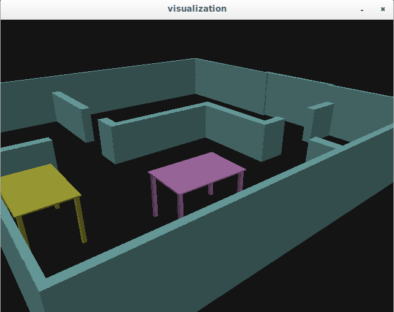

# Tutorial 5) Visualizing models

## Prerequisites
- https://github.com/tue-robotics/ed.git

## Tutorial

We already know that we can visualize the world model by adding a certain plugin to the configuration file, running ED, running some proxy program and starting RViz. But it takes a lot of time starting and restarting these programs if we are working on a model. Fortunately, there is a faster way to visualize models. Try:

    rosrun ed ed_view_model --model table

(Again, remember that you should have set ED_MODEL_PATH). You should now see the table model visualized in a separate window. Now try:

    rosrun ed ed_view_model --model robot-lab

That also works! And even better, you don't have to restart the viewer if you've made a change. Simply press 'r' and the model and visualization will reload. Now if you need to create or edit a model, all you have to do is fire up your favorite editor and run the model viewer, and you can instantly see your changes!

