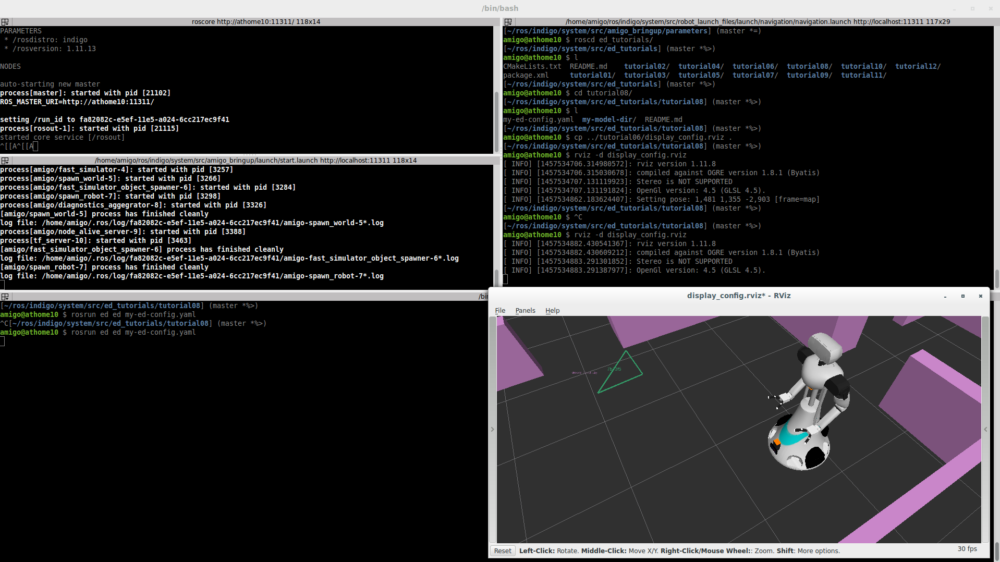

# Tutorial 8) Integration of Laser data

## Prerequisites

- https://github.com/tue-robotics/ed.git
- https://github.com/tue-robotics/ed_gui_server.git
- https://github.com/tue-robotics/ed_rviz_plugins.git
- https://github.com/tue-robotics/ed_localization.git
- https://github.com/tue-robotics/ed_sensor_integration.git

## Tutorial

If we want to track obstacles in the scene, we have to integrate the sensor
data of the robot into the world model. This can be done with use of the
sensor_integration plugins. 

The first sensor integration plugin that will be used is the laserscan plugin.
This plugin integrates laser data readings into the world model
(`sensor_msgs/Laserscan`). The plugin tries to associate all measuremed points
with existing entities in the world model, if point cannot be associated,
clusters will be created and these clusters will be tracked over time. This
allows us to follow for example a person.

In this tutorial, the config will be updated with two different plugins:
- Laser integration plugin (responsible for adding and updating newly detected
  clusters)
- Entity clearer plugin (responsible for removing clusters if they are not
  detected for a specific amount of time)

The following configuration should be added to the world_model configuration
file:

<pre>
- name: laser_integration
  lib: libed_laser_plugin.so
  frequency: 40
  parameters:
      laser_topic: /amigo/torso_laser/scan
      min_segment_size_pixels: 10
      world_association_distance: 0.4
      segment_depth_threshold: 0.2
      min_cluster_size: 0.2
      max_cluster_size: 1.0
      max_gap_size: 10
- name: entity_clearer
  lib: libed_clearer_plugin.so
  enabled: 1
  parameters:
      entity_timeout: 1.0
</pre>

As can be seen, the plugin will add entities to the scene and track these
entities over time. In this particular example, it is a block that is not
present in the world model specified by the .model file:

