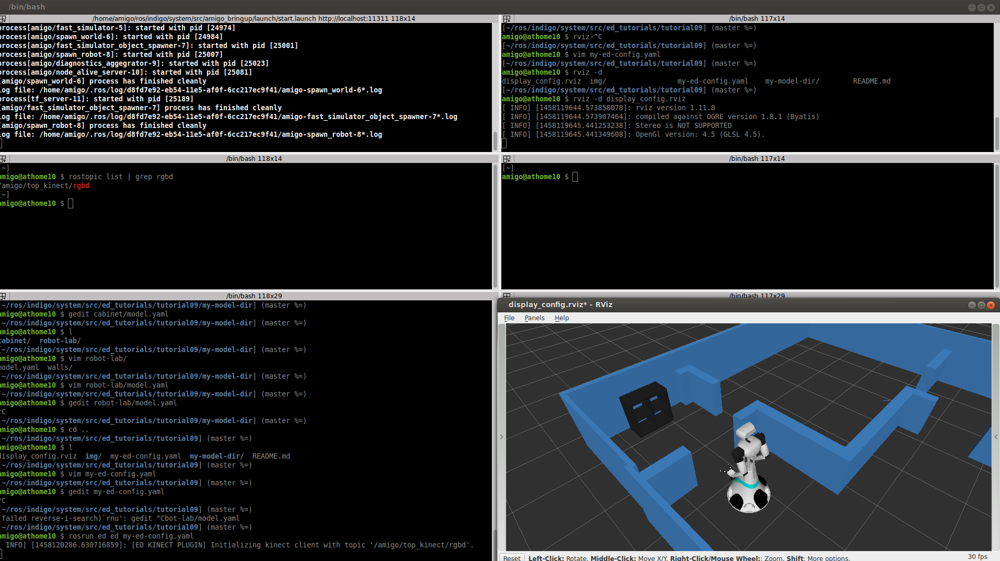
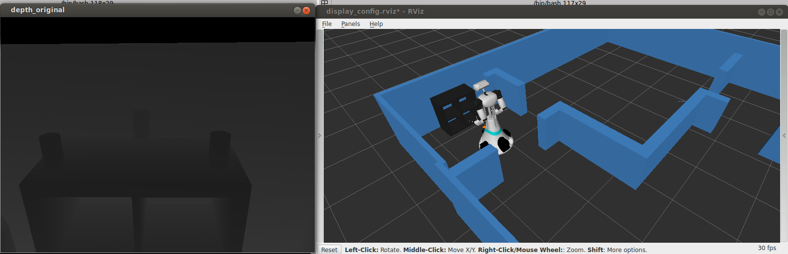
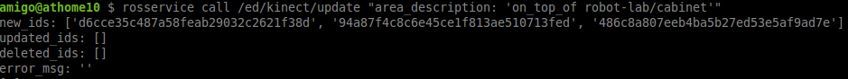
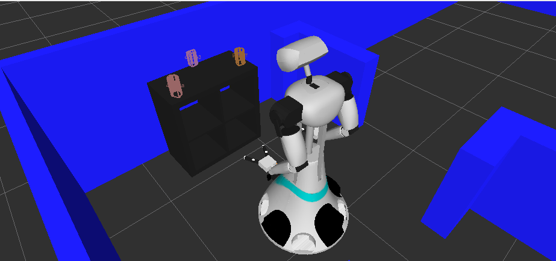

# Tutorial 9) Integration of RGBD Data

## Prerequisites

- https://github.com/tue-robotics/ed.git
- https://github.com/tue-robotics/ed_gui_server.git
- https://github.com/tue-robotics/ed_rviz_plugins.git
- https://github.com/tue-robotics/ed_localization.git
- https://github.com/tue-robotics/ed_sensor_integration.git

- https://github.com/tue-robotics/rgbd.git sensor stream

## Tutorial

In order to classify and grasp objects, dynamic objects need to be integrated in the world model with the use of sensor data. The RGBD (kinect) plugin allows adding new entities to the world model with their associated RGBD measurements. Based on the entities already available in the scene, the rgbd plugin enables segmentation and association with use of specified segmentation areas.
Segmentation, association and updating entities based on RGBD measurements will be illustrated in this tutorial.

First we need to update the model and specify an area that can be used for segmentation. We add a new model to the my-model-dir that is called cabinet:

    mkdir my-model-dir && cd my-model-dir
    mkdir cabinet && vim cabinet/model.yaml
    
Create the cabinet model
    
<pre>
shape:
  compound:
    - box:
          # Left side
          pose: {x: 0, y: -0.37, z: 0.395}
          size: {x: 0.395, y: 0.05, z: 0.79}
    - box:
          # Right side
          pose: {x: 0, y: 0.37, z: 0.395}
          size: {x: 0.395, y: 0.05, z: 0.79}
    - box:
          # Top
          pose: {x: 0, y: 0, z: 0.765}
          size: {x: 0.395, y: 0.69, z: 0.05}
    - box:
          # Bottom
          pose: {x: 0, y: 0, z: 0.025}
          size: {x: 0.395, y: 0.69, z: 0.05}
    - box:
          # Shelf
          pose: {x: 0, y: 0, z: 0.395}
          size: {x: 0.395, y: 0.69, z: 0.02}
    - box:
          # Shelf
          pose: {x: 0, y: 0, z: 0.395}
          size: {x: 0.395, y: 0.02, z: 0.69}
color:
    red: 0.1
    green: 0.1
    blue: 0.1

areas: # These areas can be used by the kinect plugin for segmentation
  - name: on_top_of
    shape:
      - box:
            min: { x: -0.17, y: -0.37, z: 0.845 }
            max: { x:  0.17, y:  0.37, z: 1.2 }
</pre>

Update the robot-lab model:

    mkdir robot-lab
    vim robot-lab/model.yaml
    
<pre>
  composition:
    - type: "robot-lab/walls"
      id: "walls"
      pose:
          x: 0
          y: 0
          z: 0
    - type: "cabinet"
      id: "cabinet"
      pose:
          x: 3.30
          y: 4.35
          z: 0
          X: 0
          Y: 0
          Z: 0
</pre>

Copy the robot-lab heightmap model to robot-lab/walls.

Now we are going to create the config for ed and make sure that we load all required plugins:

<pre>
world:
- type: robot-lab
  pose: { x: 0, y: 0, z: 0 }

plugins:
- name: gui_server
  lib: libed_gui_server_plugin.so
- name: localization
  lib: libed_localization_plugin.so
  parameters:
    robot_name: amigo
    initial_pose_topic: /amigo/initialpose
    num_particles: 500
    initial_pose:
        x: 0.586 #$(env ROBOT_INIT_X)
        y: 4.259 #$(env ROBOT_INIT_Y)
        rz: 0 #$(env ROBOT_INIT_PHI)
    laser_model:
        topic: /amigo/base_laser/scan
        num_beams: 100
        z_hit: 0.95
        sigma_hit: 0.2
        z_short: 0.1
        z_max: 0.05
        z_rand: 0.05
        lambda_short: 0.1
        range_max: 10
        min_particle_distance: 0.01
        min_particle_rotation_distance: 0.02
    odom_model:
        map_frame: map
        odom_frame: /amigo/odom
        base_link_frame: /amigo/base_link
        alpha1: 0.05   # rot -> trans + strafe
        alpha2: 0.5    # trans -> rot
        alpha3: 0.5    # trans -> trans
        alpha4: 0.5    # rot -> rot
        alpha5: 0.5    # trans -> strafeb: libed_gui_server_plugin.so

- name: rgbd_integration # Kinect integration
  lib: libed_kinect_plugin.so
  enabled: 1
  parameters:
      topic: /amigo/top_kinect/rgbd
</pre>

Now that the config is set-up, the world model can be started:

    rosrun ed ed my-ed-config.yaml
    

This looks quiet the same as previous tutorials but the cabinet entity present in the scene has now a specified area that can be used by the kinect plugin to do segmentation.

Now we move the robot towards the cabinet and open the RGBD sensor view:

With use of the exposed ROS services by the kinect integration plugin, we can segment the cans that are standing 'on_top_of' the cabinet:

    rosservice call /ed/kinect/update "area_description: 'on_top_of robot-lab/cabinet'"
    

Now we have updated the world model with use of the kinect data. See the next tutorial how to use this data.
    
