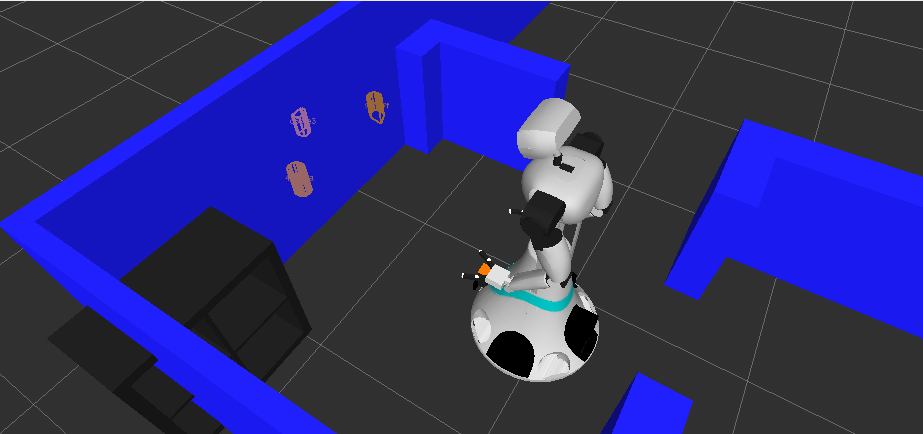
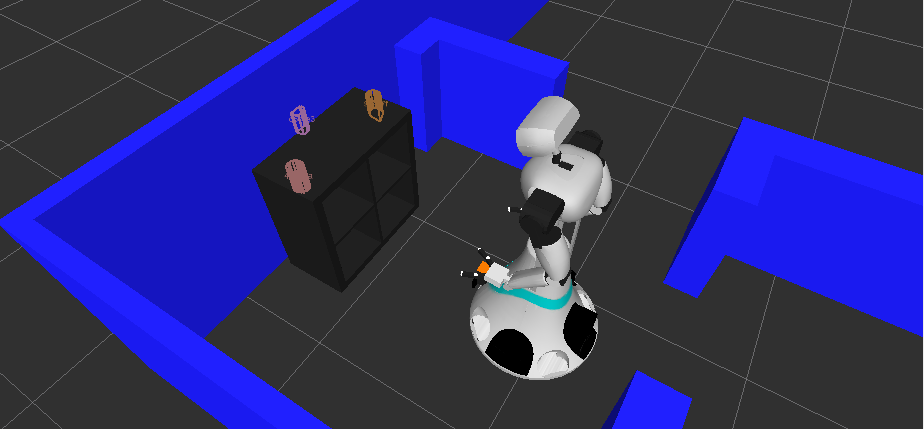

# Tutorial 10) Querying the world model

## Prerequisites

- Tutorial 09

## Tutorial

### Get

The information query interface to obtain information:
- /ed/query
- /ed/simple_query

#### ed simple query examples

Query a specific entity by id or type:
    rosservice call /ed/simple_query "id: 'robot-lab/cabinet'"
    rosservice call /ed/simple_query "type: 'cabinet'"
    
<pre>
entities: 
  - 
    id: robot-lab/cabinet
    type: cabinet
    types: ['cabinet']
    existence_probability: 1.0
    last_update_time: 
      secs: 0
      nsecs: 0
    creation_time: 
      secs: 0
      nsecs: 0
    has_shape: True
    has_pose: True
    pose: 
      position: 
        x: 3.31038931855
        y: 4.35323712675
        z: 0.0
      orientation: 
        x: 0.0
        y: 0.0
        z: 0.999976605976
        w: -0.00684013893005
    data: id: cabinet
type: cabinet
areas: 
    - name: near
      offset: 0.7
    - name: in_front_of
      shape: 
          - box: 
                max: 
                    x: 0
                    y: 0.395
                    z: 0
                min: 
                    x: -0.7
                    y: -0.395
                    z: 0
    - name: on_top_of
      shape: 
          - box: 
                max: 
                    x: 0.17
                    y: 0.37
                    z: 1.2
                min: 
                    x: -0.17
                    y: -0.37
                    z: 0.845
color: 
    blue: 0.1
    green: 0.1
    red: 0.1
pose: 
    X: 0
    Y: 0
    Z: 0
    x: 3.3
    y: 4.35
    z: 0
shape: 
    __model_path__: /home/amigo/ros/indigo/system/src/ed_tutorials/tutorial09/my-model-dir/cabinet
    compound: 
        - box: 
              pose: 
                  x: 0
                  y: -0.37
                  z: 0.395
              size: 
                  x: 0.395
                  y: 0.05
                  z: 0.79
        - box: 
              pose: 
                  x: 0
                  y: 0.37
                  z: 0.395
              size: 
                  x: 0.395
                  y: 0.05
                  z: 0.79
        - box: 
              pose: 
                  x: 0
                  y: 0
                  z: 0.765
              size: 
                  x: 0.395
                  y: 0.69
                  z: 0.05
        - box: 
              pose: 
                  x: 0
                  y: 0
                  z: 0.025
              size: 
                  x: 0.395
                  y: 0.69
                  z: 0.05
        - box: 
              pose: 
                  x: 0
                  y: 0
                  z: 0.395
              size: 
                  x: 0.395
                  y: 0.69
                  z: 0.02
        - box: 
              pose: 
                  x: 0
                  y: 0
                  z: 0.395
              size: 
                  x: 0.395
                  y: 0.02
                  z: 0.69

    flags: []
    convex_hull: 
      - 
        x: 0.202885106206
        y: -0.392261236906
        z: 0.0
      - 
        x: 0.197618320584
        y: -0.00729727279395
        z: 0.0
      - 
        x: 0.192077934742
        y: 0.397664815187
        z: 0.0
      - 
        x: -0.202885106206
        y: 0.392261236906
        z: 0.0
      - 
        x: -0.197618320584
        y: 0.00729727279395
        z: 0.0
      - 
        x: -0.192077934742
        y: -0.397664815187
        z: 0.0
    z_min: 0.0
    z_max: 0.790000021458
</pre>

Query a specific entity by point, radius:

    rosservice call /ed/simple_query "{center_point: {x: 0.0, y: 0.0, z: 0.0}, radius: 10.0}"
    
<pre>
entities: 
  - 
    id: _root
    type: ''
    types: ['', 'robot-lab']
    existence_probability: 1.0
    last_update_time: 
      secs: 0
      nsecs: 0
    creation_time: 
      secs: 0
      nsecs: 0
    has_shape: False
    has_pose: True
    pose: 
      position: 
        x: 0.0
        y: 0.0
        z: 0.0
      orientation: 
        x: 0.0
        y: 0.0
        z: 0.0
        w: 1.0
    data: composition: 
    - id: walls
      type: robot-lab/walls
      pose: 
          x: 0
          y: 0
          z: 0
    - id: cabinet
      type: cabinet
      pose: 
          X: 0
          Y: 0
          Z: 0
          x: 3.3
          y: 4.35
          z: 0

    flags: []
    convex_hull: []
    z_min: 0.0
    z_max: 0.0
  - 
    id: amigo
    type: ''
    types: []
    existence_probability: 1.0
    last_update_time: 
      secs: 0
      nsecs: 0
    creation_time: 
      secs: 0
      nsecs: 0
    has_shape: False
    has_pose: True
    pose: 
      position: 
        x: 2.08145662765
        y: 4.28862995805
        z: 0.0
      orientation: 
        x: 0.0
        y: 0.0
        z: 0.00302416455724
        w: 0.999995427204
    data: ''
    flags: []
    convex_hull: []
    z_min: 0.0
    z_max: 0.0
  - 
    id: 486c8a807eeb4ba5b27ed53e5af9ad7e
    type: ''
    types: []
    existence_probability: 1.0
    last_update_time: 
      secs: 1458123518
      nsecs: 55305719
    creation_time: 
      secs: 0
      nsecs: 0
    has_shape: False
    has_pose: True
    pose: 
      position: 
        x: 3.20672726631
        y: 4.65346574783
        z: 0.859719991684
      orientation: 
        x: 0.0
        y: 0.0
        z: 0.0
        w: 1.0
    data: ''
    flags: ['locked']
    convex_hull: 
      - 
        x: 0.0392239093781
        y: 0.00583171844482
        z: 0.0
      - 
        x: 0.0333766937256
        y: 0.0224719047546
        z: 0.0
      - 
        x: 0.0152773857117
        y: 0.034679889679
        z: 0.0
      - 
        x: 0.00480675697327
        y: 0.0371370315552
        z: 0.0
      - 
        x: -0.00618934631348
        y: 0.0364503860474
        z: 0.0
      - 
        x: -0.0141360759735
        y: 0.0331206321716
        z: 0.0
      - 
        x: -0.0250930786133
        y: 0.0275864601135
        z: 0.0
      - 
        x: -0.0349221229553
        y: 0.0225324630737
        z: 0.0
      - 
        x: -0.0360219478607
        y: 0.0215191841125
        z: 0.0
      - 
        x: -0.0381362438202
        y: 0.00861024856567
        z: 0.0
      - 
        x: -0.0387356281281
        y: 0.00386571884155
        z: 0.0
      - 
        x: -0.0390281677246
        y: 0.00146055221558
        z: 0.0
      - 
        x: -0.0390927791595
        y: 0.000222682952881
        z: 0.0
      - 
        x: -0.0391449928284
        y: -0.00184440612793
        z: 0.0
      - 
        x: -0.0392239093781
        y: -0.00527811050415
        z: 0.0
      - 
        x: -0.038321018219
        y: -0.0113458633423
        z: 0.0
      - 
        x: -0.0376143455505
        y: -0.0131440162659
        z: 0.0
      - 
        x: -0.0341644287109
        y: -0.0203342437744
        z: 0.0
      - 
        x: -0.0328481197357
        y: -0.0226497650146
        z: 0.0
      - 
        x: -0.0304548740387
        y: -0.0249772071838
        z: 0.0
      - 
        x: -0.0247893333435
        y: -0.0302429199219
        z: 0.0
      - 
        x: -0.0180222988129
        y: -0.0336847305298
        z: 0.0
      - 
        x: -0.0152671337128
        y: -0.0347476005554
        z: 0.0
      - 
        x: -0.00635170936584
        y: -0.0366768836975
        z: 0.0
      - 
        x: -0.00380802154541
        y: -0.0371370315552
        z: 0.0
      - 
        x: 0.00248384475708
        y: -0.0362648963928
        z: 0.0
      - 
        x: 0.00587153434753
        y: -0.0356140136719
        z: 0.0
      - 
        x: 0.0167899131775
        y: -0.0321588516235
        z: 0.0
      - 
        x: 0.0214669704437
        y: -0.030647277832
        z: 0.0
      - 
        x: 0.0261623859406
        y: -0.0289626121521
        z: 0.0
      - 
        x: 0.0326766967773
        y: -0.0188050270081
        z: 0.0
      - 
        x: 0.0389218330383
        y: -0.00458240509033
        z: 0.0
      - 
        x: 0.0391759872437
        y: 0.00169086456299
        z: 0.0
    z_min: -0.0732472240925
    z_max: 0.0732472240925
  - 
    id: 94a87f4c8c6e45ce1f813ae510713fed
    type: ''
    types: []
    existence_probability: 1.0
    last_update_time: 
      secs: 1458123518
      nsecs: 55305719
    creation_time: 
      secs: 0
      nsecs: 0
    has_shape: False
    has_pose: True
    pose: 
      position: 
        x: 3.2149078846
        y: 4.05492448807
        z: 0.875109434128
      orientation: 
        x: 0.0
        y: 0.0
        z: 0.0
        w: 1.0
    data: ''
    flags: ['locked']
    convex_hull: 
      - 
        x: 0.051558971405
        y: -0.00374507904053
        z: 0.0
      - 
        x: 0.050498008728
        y: 0.00256013870239
        z: 0.0
      - 
        x: 0.0370371341705
        y: 0.0230326652527
        z: 0.0
      - 
        x: 0.0257382392883
        y: 0.0290865898132
        z: 0.0
      - 
        x: 0.0240907669067
        y: 0.0295491218567
        z: 0.0
      - 
        x: 0.0217325687408
        y: 0.0300130844116
        z: 0.0
      - 
        x: -0.051558971405
        y: 0.0413913726807
        z: 0.0
      - 
        x: -0.0230357646942
        y: -0.0182433128357
        z: 0.0
      - 
        x: -0.0197319984436
        y: -0.0245342254639
        z: 0.0
      - 
        x: -0.0139212608337
        y: -0.030122756958
        z: 0.0
      - 
        x: -0.0100123882294
        y: -0.033383846283
        z: 0.0
      - 
        x: -0.00353479385376
        y: -0.03644323349
        z: 0.0
      - 
        x: 0.00309562683105
        y: -0.0392169952393
        z: 0.0
      - 
        x: 0.00447726249695
        y: -0.0397019386292
        z: 0.0
      - 
        x: 0.00963139533997
        y: -0.0409693717957
        z: 0.0
      - 
        x: 0.0129361152649
        y: -0.0413913726807
        z: 0.0
      - 
        x: 0.0178425312042
        y: -0.0410504341125
        z: 0.0
      - 
        x: 0.0277817249298
        y: -0.039183139801
        z: 0.0
      - 
        x: 0.0340149402618
        y: -0.0365395545959
        z: 0.0
      - 
        x: 0.0472724437714
        y: -0.0272698402405
        z: 0.0
      - 
        x: 0.0507864952087
        y: -0.0137157440186
        z: 0.0
    z_min: -0.0582370460033
    z_max: 0.0582370460033
  - 
    id: d6cce35c487a58feab29032c2621f38d
    type: ''
    types: []
    existence_probability: 1.0
    last_update_time: 
      secs: 1458123518
      nsecs: 55305719
    creation_time: 
      secs: 0
      nsecs: 0
    has_shape: False
    has_pose: True
    pose: 
      position: 
        x: 3.45482587814
        y: 4.35548448563
        z: 0.878841638565
      orientation: 
        x: 0.0
        y: 0.0
        z: 0.0
        w: 1.0
    data: ''
    flags: ['locked']
    convex_hull: 
      - 
        x: 0.0232918262482
        y: -0.0268640518188
        z: 0.0
      - 
        x: 0.0224661827087
        y: 0.0357685089111
        z: 0.0
      - 
        x: 0.018119096756
        y: 0.0356936454773
        z: 0.0
      - 
        x: 0.0111262798309
        y: 0.0349197387695
        z: 0.0
      - 
        x: -0.0213444232941
        y: 0.0296258926392
        z: 0.0
      - 
        x: -0.0232920646667
        y: 0.0290665626526
        z: 0.0
      - 
        x: -0.0199267864227
        y: -0.0015811920166
        z: 0.0
      - 
        x: -0.0182507038116
        y: -0.010627746582
        z: 0.0
      - 
        x: -0.017902135849
        y: -0.0119400024414
        z: 0.0
      - 
        x: -0.0138068199158
        y: -0.0209307670593
        z: 0.0
      - 
        x: -0.0107560157776
        y: -0.024778842926
        z: 0.0
      - 
        x: -0.00377416610718
        y: -0.0300679206848
        z: 0.0
      - 
        x: -0.000791072845459
        y: -0.0320043563843
        z: 0.0
      - 
        x: 0.00361275672913
        y: -0.0346345901489
        z: 0.0
      - 
        x: 0.0228731632233
        y: -0.0357685089111
        z: 0.0
    z_min: -0.0612957775593
    z_max: 0.0612957775593
</pre>

## ed query interface

Returns json diff since a specified revision

    rosservice call /ed/query "since_revision: 0
    
<pre>
  human_readable: {"entities":[{"id":"_root","idx":0,"type":"","existence_prob":1,"timestamp":{"sec":0,"nsec":0},"pose":{"x":0,"y":0,"z":0,"qx":0,"qy":0,"qz":0,"qw":1},"properties":[]},{"id":"cabinet","idx":1,"type":"cabinet","existence_prob":1,"timestamp":{"sec":0,"nsec":0},"convex_hull":{"points":[{"x":0.204006,"y":-0.39168},{"x":0.197638,"y":-0.00673228},{"x":0.191767,"y":0.348219},{"x":0.19094,"y":0.398212},{"x":-0.204006,"y":0.39168},{"x":-0.197638,"y":0.00673228},{"x":-0.191767,"y":-0.348219},{"x":-0.19094,"y":-0.398212}],"z_min":0,"z_max":0.79},"pose":{"x":3.3073,"y":4.35349,"z":0,"qx":0,"qy":0,"qz":0.999966,"qw":-0.00826952},"mesh":{"vertices":[{"x":-0.1975,"y":-0.395,"z":0},{"x":0.1975,"y":-0.395,"z":0},{"x":-0.1975,"y":-0.345,"z":0},{"x":0.1975,"y":-0.345,"z":0},{"x":-0.1975,"y":-0.395,"z":0.79},{"x":0.1975,"y":-0.395,"z":0.79},{"x":-0.1975,"y":-0.345,"z":0.79},{"x":0.1975,"y":-0.345,"z":0.79},{"x":-0.1975,"y":0.345,"z":0},{"x":0.1975,"y":0.345,"z":0},{"x":-0.1975,"y":0.395,"z":0},{"x":0.1975,"y":0.395,"z":0},{"x":-0.1975,"y":0.345,"z":0.79},{"x":0.1975,"y":0.345,"z":0.79},{"x":-0.1975,"y":0.395,"z":0.79},{"x":0.1975,"y":0.395,"z":0.79},{"x":-0.1975,"y":-0.345,"z":0.74},{"x":0.1975,"y":-0.345,"z":0.74},{"x":-0.1975,"y":0.345,"z":0.74},{"x":0.1975,"y":0.345,"z":0.74},{"x":-0.1975,"y":-0.345,"z":0.79},{"x":0.1975,"y":-0.345,"z":0.79},{"x":-0.1975,"y":0.345,"z":0.79},{"x":0.1975,"y":0.345,"z":0.79},{"x":-0.1975,"y":-0.345,"z":0},{"x":0.1975,"y":-0.345,"z":0},{"x":-0.1975,"y":0.345,"z":0},{"x":0.1975,"y":0.345,"z":0},{"x":-0.1975,"y":-0.345,"z":0.05},{"x":0.1975,"y":-0.345,"z":0.05},{"x":-0.1975,"y":0.345,"z":0.05},{"x":0.1975,"y":0.345,"z":0.05},{"x":-0.1975,"y":-0.345,"z":0.385},{"x":0.1975,"y":-0.345,"z":0.385},{"x":-0.1975,"y":0.345,"z":0.385},{"x":0.1975,"y":0.345,"z":0.385},{"x":-0.1975,"y":-0.345,"z":0.405},{"x":0.1975,"y":-0.345,"z":0.405},{"x":-0.1975,"y":0.345,"z":0.405},{"x":0.1975,"y":0.345,"z":0.405},{"x":-0.1975,"y":-0.01,"z":0.05},{"x":0.1975,"y":-0.01,"z":0.05},{"x":-0.1975,"y":0.01,"z":0.05},{"x":0.1975,"y":0.01,"z":0.05},{"x":-0.1975,"y":-0.01,"z":0.74},{"x":0.1975,"y":-0.01,"z":0.74},{"x":-0.1975,"y":0.01,"z":0.74},{"x":0.1975,"y":0.01,"z":0.74}],"triangles":[{"i1":1,"i2":0,"i3":2},{"i1":1,"i2":2,"i3":3},{"i1":4,"i2":5,"i3":6},{"i1":6,"i2":5,"i3":7},{"i1":0,"i2":4,"i3":2},{"i1":2,"i2":4,"i3":6},{"i1":5,"i2":1,"i3":3},{"i1":5,"i2":3,"i3":7},{"i1":0,"i2":1,"i3":4},{"i1":4,"i2":1,"i3":5},{"i1":3,"i2":2,"i3":6},{"i1":3,"i2":6,"i3":7},{"i1":9,"i2":8,"i3":10},{"i1":9,"i2":10,"i3":11},{"i1":12,"i2":13,"i3":14},{"i1":14,"i2":13,"i3":15},{"i1":8,"i2":12,"i3":10},{"i1":10,"i2":12,"i3":14},{"i1":13,"i2":9,"i3":11},{"i1":13,"i2":11,"i3":15},{"i1":8,"i2":9,"i3":12},{"i1":12,"i2":9,"i3":13},{"i1":11,"i2":10,"i3":14},{"i1":11,"i2":14,"i3":15},{"i1":17,"i2":16,"i3":18},{"i1":17,"i2":18,"i3":19},{"i1":20,"i2":21,"i3":22},{"i1":22,"i2":21,"i3":23},{"i1":16,"i2":20,"i3":18},{"i1":18,"i2":20,"i3":22},{"i1":21,"i2":17,"i3":19},{"i1":21,"i2":19,"i3":23},{"i1":16,"i2":17,"i3":20},{"i1":20,"i2":17,"i3":21},{"i1":19,"i2":18,"i3":22},{"i1":19,"i2":22,"i3":23},{"i1":25,"i2":24,"i3":26},{"i1":25,"i2":26,"i3":27},{"i1":28,"i2":29,"i3":30},{"i1":30,"i2":29,"i3":31},{"i1":24,"i2":28,"i3":26},{"i1":26,"i2":28,"i3":30},{"i1":29,"i2":25,"i3":27},{"i1":29,"i2":27,"i3":31},{"i1":24,"i2":25,"i3":28},{"i1":28,"i2":25,"i3":29},{"i1":27,"i2":26,"i3":30},{"i1":27,"i2":30,"i3":31},{"i1":33,"i2":32,"i3":34},{"i1":33,"i2":34,"i3":35},{"i1":36,"i2":37,"i3":38},{"i1":38,"i2":37,"i3":39},{"i1":32,"i2":36,"i3":34},{"i1":34,"i2":36,"i3":38},{"i1":37,"i2":33,"i3":35},{"i1":37,"i2":35,"i3":39},{"i1":32,"i2":33,"i3":36},{"i1":36,"i2":33,"i3":37},{"i1":35,"i2":34,"i3":38},{"i1":35,"i2":38,"i3":39},{"i1":41,"i2":40,"i3":42},{"i1":41,"i2":42,"i3":43},{"i1":44,"i2":45,"i3":46},{"i1":46,"i2":45,"i3":47},{"i1":40,"i2":44,"i3":42},{"i1":42,"i2":44,"i3":46},{"i1":45,"i2":41,"i3":43},{"i1":45,"i2":43,"i3":47},{"i1":40,"i2":41,"i3":44},{"i1":44,"i2":41,"i3":45},{"i1":43,"i2":42,"i3":46},{"i1":43,"i2":46,"i3":47}]},"properties":[]},{"id":"walls","idx":2,"type":"robot-lab/walls","existence_prob":1,"timestamp":{"sec":0,"nsec":0},"convex_hull":{"points":[{"x":3.65,"y":5.575},{"x":1.375,"y":5.625},{"x":-0.675,"y":5.625},{"x":-3.825,"y":5.575},{"x":-3.825,"y":-1.775},{"x":3.65,"y":-1.775}],"z_min":0,"z_max":1.2},"pose":{"x":0,"y":0,"z":0,"qx":0,"qy":0,"qz":0,"qw":1},"mesh":{"vertices":[{"x":1.375,"y":5.625,"z":0},{"x":1.375,"y":5.625,"z":1.2},{"x":1.375,"y":5.575,"z":0},{"x":1.375,"y":5.575,"z":1.2},{"x":3.65,"y":5.575,"z":0},{"x":3.65,"y":5.575,"z":1.2},{"x":3.65,"y":-1.775,"z":0},{"x":3.65,"y":-1.775,"z":1.2},{"x":-3.825,"y":-1.775,"z":0},{"x":-3.825,"y":-1.775,"z":1.2},{"x":-3.825,"y":5.575,"z":0},{"x":-3.825,"y":5.575,"z":1.2},{"x":-0.675,"y":5.575,"z":0},{"x":-0.675,"y":5.575,"z":1.2},{"x":-0.675,"y":5.625,"z":0},{"x":-0.675,"y":5.625,"z":1.2},{"x":-3.75,"y":-1.7,"z":0},{"x":-3.75,"y":-1.7,"z":1.2},{"x":3.55,"y":-1.7,"z":0},{"x":3.55,"y":-1.7,"z":1.2},{"x":3.55,"y":5.5,"z":0},{"x":3.55,"y":5.5,"z":1.2},{"x":1.3,"y":5.5,"z":0},{"x":1.3,"y":5.5,"z":1.2},{"x":1.3,"y":5.55,"z":0},{"x":1.3,"y":5.55,"z":1.2},{"x":-0.575,"y":5.55,"z":0},{"x":-0.575,"y":5.55,"z":1.2},{"x":-0.575,"y":5.5,"z":0},{"x":-0.575,"y":5.5,"z":1.2},{"x":-3.75,"y":5.5,"z":0},{"x":-3.75,"y":5.5,"z":1.2},{"x":1.55,"y":5.5,"z":0},{"x":1.55,"y":5.5,"z":0.8},{"x":1.55,"y":4.7,"z":0},{"x":1.55,"y":4.7,"z":0.8},{"x":1.35,"y":4.7,"z":0},{"x":1.35,"y":4.7,"z":0.8},{"x":1.35,"y":5.5,"z":0},{"x":1.35,"y":5.5,"z":0.8},{"x":1.55,"y":3.65,"z":0},{"x":1.55,"y":3.65,"z":0.8},{"x":1.55,"y":3.025,"z":0},{"x":1.55,"y":3.025,"z":0.8},{"x":-0.25,"y":3.025,"z":0},{"x":-0.25,"y":3.025,"z":0.8},{"x":-0.25,"y":0.625,"z":0},{"x":-0.25,"y":0.625,"z":0.8},{"x":-0.85,"y":0.625,"z":0},{"x":-0.85,"y":0.625,"z":0.8},{"x":-0.85,"y":0.825,"z":0},{"x":-0.85,"y":0.825,"z":0.8},{"x":-0.45,"y":0.825,"z":0},{"x":-0.45,"y":0.825,"z":0.8},{"x":-0.45,"y":3.25,"z":0},{"x":-0.45,"y":3.25,"z":0.8},{"x":1.35,"y":3.25,"z":0},{"x":1.35,"y":3.25,"z":0.8},{"x":1.35,"y":3.65,"z":0},{"x":1.35,"y":3.65,"z":0.8},{"x":3.55,"y":3.45,"z":0},{"x":3.55,"y":3.45,"z":0.8},{"x":3.55,"y":3.05,"z":0},{"x":3.55,"y":3.05,"z":0.8},{"x":2.55,"y":3.05,"z":0},{"x":2.55,"y":3.05,"z":0.8},{"x":2.55,"y":3.25,"z":0},{"x":2.55,"y":3.25,"z":0.8},{"x":3.35,"y":3.25,"z":0},{"x":3.35,"y":3.25,"z":0.8},{"x":3.35,"y":3.45,"z":0},{"x":3.35,"y":3.45,"z":0.8},{"x":-1.75,"y":0.825,"z":0},{"x":-1.75,"y":0.825,"z":0.8},{"x":-1.75,"y":0.625,"z":0},{"x":-1.75,"y":0.625,"z":0.8},{"x":-3.75,"y":0.625,"z":0},{"x":-3.75,"y":0.625,"z":0.8},{"x":-3.75,"y":0.825,"z":0},{"x":-3.75,"y":0.825,"z":0.8},{"x":-0.25,"y":-0.5,"z":0},{"x":-0.25,"y":-0.5,"z":0.8},{"x":-0.25,"y":-1.7,"z":0},{"x":-0.25,"y":-1.7,"z":0.8},{"x":-0.45,"y":-1.7,"z":0},{"x":-0.45,"y":-1.7,"z":0.8},{"x":-0.45,"y":-0.5,"z":0},{"x":-0.45,"y":-0.5,"z":0.8}],"triangles":[{"i1":0,"i2":1,"i3":2},{"i1":1,"i2":3,"i3":2},{"i1":2,"i2":3,"i3":4},{"i1":3,"i2":5,"i3":4},{"i1":4,"i2":5,"i3":6},{"i1":5,"i2":7,"i3":6},{"i1":6,"i2":7,"i3":8},{"i1":7,"i2":9,"i3":8},{"i1":8,"i2":9,"i3":10},{"i1":9,"i2":11,"i3":10},{"i1":10,"i2":11,"i3":12},{"i1":11,"i2":13,"i3":12},{"i1":12,"i2":13,"i3":14},{"i1":13,"i2":15,"i3":14},{"i1":14,"i2":15,"i3":0},{"i1":15,"i2":1,"i3":0},{"i1":16,"i2":17,"i3":18},{"i1":18,"i2":17,"i3":19},{"i1":18,"i2":19,"i3":20},{"i1":20,"i2":19,"i3":21},{"i1":20,"i2":21,"i3":22},{"i1":22,"i2":21,"i3":23},{"i1":22,"i2":23,"i3":24},{"i1":24,"i2":23,"i3":25},{"i1":24,"i2":25,"i3":26},{"i1":26,"i2":25,"i3":27},{"i1":26,"i2":27,"i3":28},{"i1":28,"i2":27,"i3":29},{"i1":28,"i2":29,"i3":30},{"i1":30,"i2":29,"i3":31},{"i1":30,"i2":31,"i3":16},{"i1":16,"i2":31,"i3":17},{"i1":19,"i2":9,"i3":7},{"i1":17,"i2":9,"i3":19},{"i1":17,"i2":11,"i3":9},{"i1":31,"i2":11,"i3":17},{"i1":31,"i2":13,"i3":11},{"i1":29,"i2":13,"i3":31},{"i1":5,"i2":19,"i3":7},{"i1":5,"i2":21,"i3":19},{"i1":3,"i2":21,"i3":5},{"i1":3,"i2":23,"i3":21},{"i1":3,"i2":25,"i3":23},{"i1":27,"i2":13,"i3":29},{"i1":15,"i2":3,"i3":1},{"i1":15,"i2":25,"i3":3},{"i1":15,"i2":27,"i3":25},{"i1":15,"i2":13,"i3":27},{"i1":32,"i2":33,"i3":34},{"i1":33,"i2":35,"i3":34},{"i1":34,"i2":35,"i3":36},{"i1":35,"i2":37,"i3":36},{"i1":36,"i2":37,"i3":38},{"i1":37,"i2":39,"i3":38},{"i1":38,"i2":39,"i3":32},{"i1":39,"i2":33,"i3":32},{"i1":39,"i2":35,"i3":33},{"i1":39,"i2":37,"i3":35},{"i1":40,"i2":41,"i3":42},{"i1":41,"i2":43,"i3":42},{"i1":42,"i2":43,"i3":44},{"i1":43,"i2":45,"i3":44},{"i1":44,"i2":45,"i3":46},{"i1":45,"i2":47,"i3":46},{"i1":46,"i2":47,"i3":48},{"i1":47,"i2":49,"i3":48},{"i1":48,"i2":49,"i3":50},{"i1":49,"i2":51,"i3":50},{"i1":50,"i2":51,"i3":52},{"i1":51,"i2":53,"i3":52},{"i1":52,"i2":53,"i3":54},{"i1":53,"i2":55,"i3":54},{"i1":54,"i2":55,"i3":56},{"i1":55,"i2":57,"i3":56},{"i1":56,"i2":57,"i3":58},{"i1":57,"i2":59,"i3":58},{"i1":58,"i2":59,"i3":40},{"i1":59,"i2":41,"i3":40},{"i1":59,"i2":43,"i3":41},{"i1":57,"i2":43,"i3":59},{"i1":57,"i2":45,"i3":43},{"i1":55,"i2":45,"i3":57},{"i1":53,"i2":45,"i3":55},{"i1":53,"i2":47,"i3":45},{"i1":53,"i2":49,"i3":47},{"i1":53,"i2":51,"i3":49},{"i1":60,"i2":61,"i3":62},{"i1":61,"i2":63,"i3":62},{"i1":62,"i2":63,"i3":64},{"i1":63,"i2":65,"i3":64},{"i1":64,"i2":65,"i3":66},{"i1":65,"i2":67,"i3":66},{"i1":66,"i2":67,"i3":68},{"i1":67,"i2":69,"i3":68},{"i1":68,"i2":69,"i3":70},{"i1":69,"i2":71,"i3":70},{"i1":70,"i2":71,"i3":60},{"i1":71,"i2":61,"i3":60},{"i1":71,"i2":63,"i3":61},{"i1":69,"i2":63,"i3":71},{"i1":69,"i2":65,"i3":63},{"i1":69,"i2":67,"i3":65},{"i1":72,"i2":73,"i3":74},{"i1":73,"i2":75,"i3":74},{"i1":74,"i2":75,"i3":76},{"i1":75,"i2":77,"i3":76},{"i1":76,"i2":77,"i3":78},{"i1":77,"i2":79,"i3":78},{"i1":78,"i2":79,"i3":72},{"i1":79,"i2":73,"i3":72},{"i1":79,"i2":75,"i3":73},{"i1":79,"i2":77,"i3":75},{"i1":80,"i2":81,"i3":82},{"i1":81,"i2":83,"i3":82},{"i1":82,"i2":83,"i3":84},{"i1":83,"i2":85,"i3":84},{"i1":84,"i2":85,"i3":86},{"i1":85,"i2":87,"i3":86},{"i1":86,"i2":87,"i3":80},{"i1":87,"i2":81,"i3":80},{"i1":87,"i2":83,"i3":81},{"i1":87,"i2":85,"i3":83}]},"properties":[]},{"id":"amigo","idx":3,"type":"","existence_prob":1,"timestamp":{"sec":0,"nsec":0},"pose":{"x":2.08146,"y":4.28863,"z":0,"qx":0,"qy":0,"qz":0.00302416,"qw":0.999995},"properties":[]},{"id":"486c8a807eeb4ba5b27ed53e5af9ad7e","idx":4,"type":"","existence_prob":1,"timestamp":{"sec":1458123518,"nsec":55305719},"convex_hull":{"points":[{"x":0.0392239,"y":0.00583172},{"x":0.0333767,"y":0.0224719},{"x":0.0152774,"y":0.0346799},{"x":0.00480676,"y":0.037137},{"x":-0.00618935,"y":0.0364504},{"x":-0.0141361,"y":0.0331206},{"x":-0.0250931,"y":0.0275865},{"x":-0.0349221,"y":0.0225325},{"x":-0.0360219,"y":0.0215192},{"x":-0.0381362,"y":0.00861025},{"x":-0.0387356,"y":0.00386572},{"x":-0.0390282,"y":0.00146055},{"x":-0.0390928,"y":0.000222683},{"x":-0.039145,"y":-0.00184441},{"x":-0.0392239,"y":-0.00527811},{"x":-0.038321,"y":-0.0113459},{"x":-0.0376143,"y":-0.013144},{"x":-0.0341644,"y":-0.0203342},{"x":-0.0328481,"y":-0.0226498},{"x":-0.0304549,"y":-0.0249772},{"x":-0.0247893,"y":-0.0302429},{"x":-0.0180223,"y":-0.0336847},{"x":-0.0152671,"y":-0.0347476},{"x":-0.00635171,"y":-0.0366769},{"x":-0.00380802,"y":-0.037137},{"x":0.00248384,"y":-0.0362649},{"x":0.00587153,"y":-0.035614},{"x":0.0167899,"y":-0.0321589},{"x":0.021467,"y":-0.0306473},{"x":0.0261624,"y":-0.0289626},{"x":0.0326767,"y":-0.018805},{"x":0.0389218,"y":-0.00458241},{"x":0.039176,"y":0.00169086}],"z_min":-0.0732472,"z_max":0.0732472},"pose":{"x":3.20673,"y":4.65347,"z":0.85972,"qx":0,"qy":0,"qz":0,"qw":1},"properties":[]},{"id":"94a87f4c8c6e45ce1f813ae510713fed","idx":5,"type":"","existence_prob":1,"timestamp":{"sec":1458123518,"nsec":55305719},"convex_hull":{"points":[{"x":0.051559,"y":-0.00374508},{"x":0.050498,"y":0.00256014},{"x":0.0370371,"y":0.0230327},{"x":0.0257382,"y":0.0290866},{"x":0.0240908,"y":0.0295491},{"x":0.0217326,"y":0.0300131},{"x":-0.051559,"y":0.0413914},{"x":-0.0230358,"y":-0.0182433},{"x":-0.019732,"y":-0.0245342},{"x":-0.0139213,"y":-0.0301228},{"x":-0.0100124,"y":-0.0333838},{"x":-0.00353479,"y":-0.0364432},{"x":0.00309563,"y":-0.039217},{"x":0.00447726,"y":-0.0397019},{"x":0.0096314,"y":-0.0409694},{"x":0.0129361,"y":-0.0413914},{"x":0.0178425,"y":-0.0410504},{"x":0.0277817,"y":-0.0391831},{"x":0.0340149,"y":-0.0365396},{"x":0.0472724,"y":-0.0272698},{"x":0.0507865,"y":-0.0137157}],"z_min":-0.058237,"z_max":0.058237},"pose":{"x":3.21491,"y":4.05492,"z":0.875109,"qx":0,"qy":0,"qz":0,"qw":1},"properties":[]},{"id":"d6cce35c487a58feab29032c2621f38d","idx":6,"type":"","existence_prob":1,"timestamp":{"sec":1458123518,"nsec":55305719},"convex_hull":{"points":[{"x":0.0232918,"y":-0.0268641},{"x":0.0224662,"y":0.0357685},{"x":0.0181191,"y":0.0356936},{"x":0.0111263,"y":0.0349197},{"x":-0.0213444,"y":0.0296259},{"x":-0.0232921,"y":0.0290666},{"x":-0.0199268,"y":-0.00158119},{"x":-0.0182507,"y":-0.0106277},{"x":-0.0179021,"y":-0.01194},{"x":-0.0138068,"y":-0.0209308},{"x":-0.010756,"y":-0.0247788},{"x":-0.00377417,"y":-0.0300679},{"x":-0.000791073,"y":-0.0320044},{"x":0.00361276,"y":-0.0346346},{"x":0.0228732,"y":-0.0357685}],"z_min":-0.0612958,"z_max":0.0612958},"pose":{"x":3.45483,"y":4.35548,"z":0.878842,"qx":0,"qy":0,"qz":0,"qw":1},"properties":[]}]}
new_revision: 2979
</pre>

It is also possible to query for specific properties or entity ids.

### Update

    rosservice call /ed/update "request: '{\"entities\": [{\"id\": \"cabinet\", \"pose\": {\"x\": 3.3, \"y\": 5.35, \"z\": 0}}]}'"
    

    
    rosservice call /ed/update "request: '{\"entities\": [{\"id\": \"cabinet\", \"pose\": {\"x\": 3.3, \"y\": 4.3, \"z\": 0}}]}'" 
    

