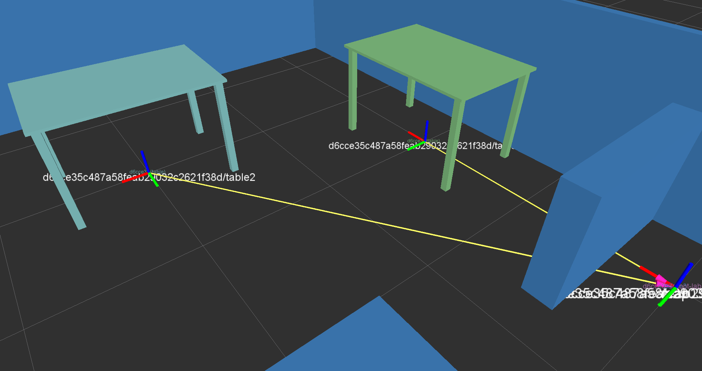

# Tutorial 12) Publishing transforms for /tf

## Prerequisites

- https://github.com/tue-robotics/ed.git
- https://github.com/tue-robotics/ed_gui_server.git
- https://github.com/tue-robotics/ed_rviz_plugins.git

## Tutorial

Some components in your ROS network required transformation published over TF. The world model ED has a plugin for this:

<pre>
  - name: tf_publisher
    lib: libed_tf_publisher_plugin.so
    parameters:
      root_frame_id: /map
      exclude: optional_ids_to_exclude
</pre>

