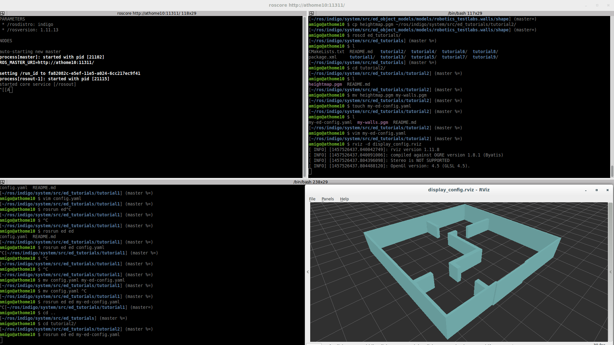

# Tutorial 2) Specifying a more complex world

## Prerequisites
- https://github.com/tue-robotics/ed.git
- https://github.com/tue-robotics/ed_gui_server.git
- https://github.com/tue-robotics/ed_rviz_plugins.git

## Tutorial

So far, we have created a configuration file which tells ED to create a world consisting of two blocks, and running a plugin which helps visualizing this world in RViz. That's nice, but not very useful. We need to create a model of the world the robot is living in, and that will be a bit more work than just adding a couple of boxes. Fortunately, ED allows you to use quite some powerful expressions to create the shapes you need. On of those is particularly useful if you already have a 2D map of the robots' environment: the height map. If you have used some sort of SLAM method (e.g., http://wiki.ros.org/gmapping) to create a 2D occupancy map of the environment, then you can almost directly use this map to specify the shape of an entity in ED.

We assume you have created a 2D occupancy map using [ROS' GMapping](http://wiki.ros.org/gmapping) and used the map saver from [ROS map server](http://wiki.ros.org/map_server) to store the map. This will leave you with two files: a PGM image file containing the occupancy grid and a YAML-file with the meta-data. The image file has white pixels for all non-occupied cells, and black pixels for occupied cells. The meta-data contains the origin of the map, and the resolution.

In some simple steps, these two files can be converted to an ED world specification:

1. Copy or move the PGM-file to the same directory in which you stored the 'my-ed-config.yaml' configuration file, and call it 'my-walls.pgm'.
2. Open the map with your favorite image editor (e.g., Gimp). Make sure all gray pixels (which are 'unknowns' in the map) are changed into white. You should only have black and white pixels.
3. Take a look at the map's YAML file. Remember the 'resolution' and 'origin' fields
4. Change 'my-ed-config.yaml' to the following:

<pre>
    world:
    - id: walls
      shape:
        heightmap:
          image: $(file my-walls.pgm)
          height: 2
          resolution: 0.025
          pose: { x: -10.0, y: -10.0, z: 0 }

    plugins:
      - name: gui_server
        lib: libed_gui_server_plugin.so
</pre>

**Note that you have to put the correct values in the 'resolution' and 'pose' field (as found in the map YAML file in step 3).**

That's it! This config file tells ED that it should load the heightmap from the specified 'my-walls.pgm' image. The 'height' field specifies how high the walls have to be.

Now, it is important to know that:

1. You do not necessarily need GMapping to do this. You can use any other SLAM-method, or simply draw the heightmap yourself! Often, we (the authors of this tutorial) start with a SLAM-created map, but clean it up and reduce it until only the walls are left.
2. This is more than a 2D occupancy grid. We only used black and white pixels in the example above, but any gray value can be used. The 'blackness' of a pixel defines it's height: black is the highest, white is floor-level, but you can specify anything in between.

To visualize the world model specified in the config file above, simply run ED and the ed_rviz_publisher again, and use RViz.

    rosrun ed ed <path/to/my-ed-config.yaml>
    rosrun ed_gui_server ed_rviz_publisher
    
You can also use the rviz plugin: Start rviz and add the ed_rviz_plugins/WorldModel display. Configure the service for querying the meshes and the ED entities topic, e.g. /ed/gui/entities and /ed/gui/query_meshes

